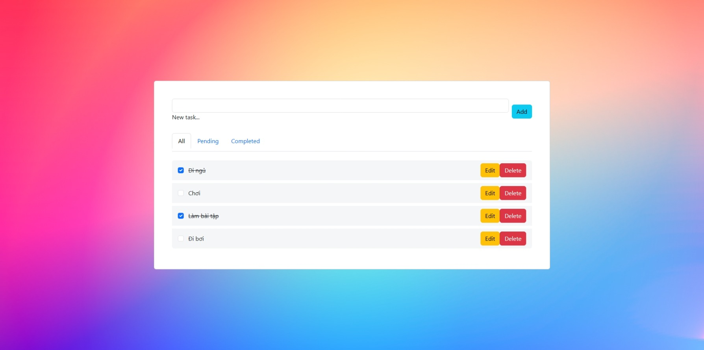
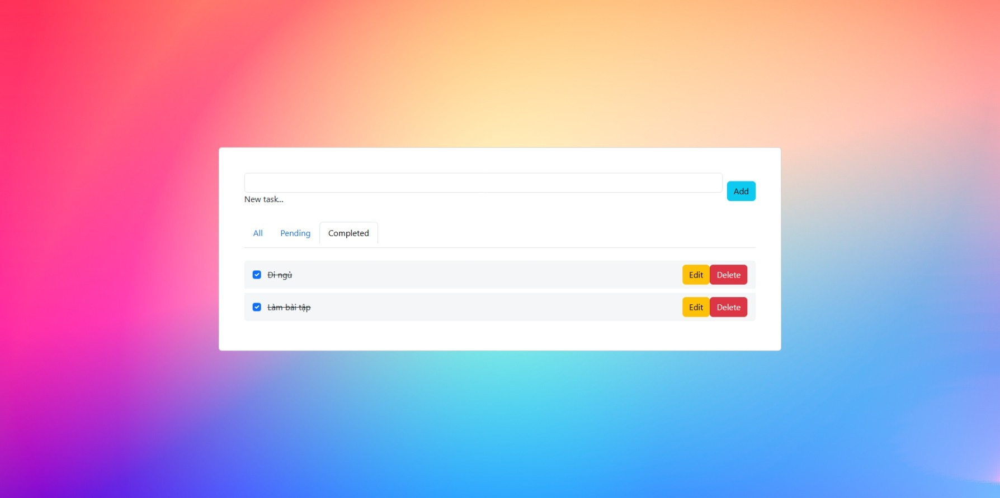
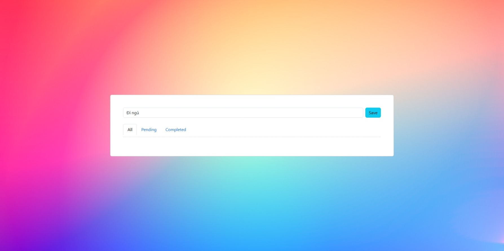

## Todo List (Laravel)

Ứng dụng quản lý công việc đơn giản, cho phép thêm, chỉnh sửa, đánh dấu hoàn thành và xóa các nhiệm vụ hàng ngày.

🚀 Tính năng

Thêm công việc mới.

Chỉnh sửa công việc hiện tại.

Đánh dấu công việc đã hoàn thành.

Xóa công việc không cần thiết.

🛠 Công nghệ sử dụng

Backend: Laravel 10.x, PHP 8.x

Frontend: Blade, Bootstrap 5, JavaScript

Database: MySQL

## ⚙️ Hướng dẫn cài đặt

1. **Clone repository**

```bash
git clone https://github.com/thienok990/todo_list.git
cd todo_list
```

2. **Cài đặt dependencies**

```bash
composer install
npm install
```

3. **Copy file cấu hình môi trường**

```bash
cp .env.example .env
```

-   Cấu hình database trong `.env`:

```
DB_CONNECTION=mysql
DB_HOST=127.0.0.1
DB_PORT=3306
DB_DATABASE=todolist
DB_USERNAME=root
DB_PASSWORD=
```

4. **Tạo key ứng dụng**

```bash
php artisan key:generate
```

5. **Import dữ liệu từ file SQL**

Thay vì chạy migration và seed, bạn import trực tiếp file SQL:
```bash
-   Mở công cụ quản lý MySQL bạn đang dùng (PHPMyAdmin, HeidiSQL, DBeaver…).

-   Tạo một database mới, ví dụ todolist.

-   Chọn database vừa tạo → Import → chọn file todolist.sql trong thư mục database.

-   Nhấn “Go” hoặc “Start” để import toàn bộ dữ liệu.
```

7. **Build assets bằng Vite**

```bash
npm run build
```

-   Hoặc dev mode:

```bash
npm run dev
```

8. **Chạy server**

```bash
php artisan serve 
```

-   Truy cập: `http://127.0.0.1:8000`

**📷 Hình ảnh minh họa**

**Danh sách Task**


**Các task Pending**


**Các task Completed**


**Chỉnh sửa Task**

